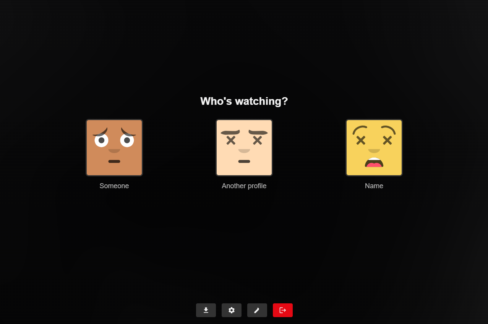

# Zentrio

  

  <strong>Stream Your Way</strong>

  
  
  
  
  
  

  <a href="https://zentrio.eu"><strong>🌐 Public Instance</strong></a> •
  <a href="https://docs.zentrio.eu"><strong>📚 Documentation</strong></a> •
  <a href="https://github.com/MichielEijpe/Zentrio/issues"><strong>🐛 Report Issues</strong></a>

<b>⚠️ Disclaimer: Built with AI</b>

Zentrio was built with substantial assistance from AI tooling, guided by an engineering student exploring what these tools make possible.

Although the project is maintained with care, it remains experimental and may contain imperfections. **Please use it at your own risk**, and consider using unique credentials instead of your primary Stremio account for additional safety.

## 🚀 Getting Started

Zentrio is easiest to explore via the public instance and hosted documentation:

- 🌐 Public instance: [**zentrio.eu**](https://zentrio.eu)
- 📚 Documentation: [**docs.zentrio.eu**](https://docs.zentrio.eu)

For deployment, self-hosting, and development setup instructions, refer to the documentation.

## 📖 What is Zentrio?

Zentrio is a modern, self-hosted streaming hub that brings your content together. Originally conceived as a profile manager for Stremio, it has evolved into a standalone platform with a focus on user experience and customization.

- **👥 Profile Management** - Create separate profiles with unique preferences and watch history.
- **🎨 Modern UI** - A clean, glassmorphic interface designed for immersion.
- **🧩 Addon System** - Extend functionality with Stremio-compatible addons.
- **📱 Cross-Platform Support** - Web, iOS, Android, and PWA.
- **🔒 Privacy-Focused** - Your data stays local and secure.

<!-- 

  

 -->

## Origin Story

Zentrio started as a weekend project to solve [this community issue](https://github.com/Stremio/stremio-features/issues/622) regarding Stremio profiles. The initial goal was simple: provide a way to manage multiple users on Stremio Web.

However, as development progressed, the vision expanded. We realized that a truly great experience required more than just profile switching—it needed a dedicated interface, better discovery, and a more cohesive design. Today, Zentrio stands as its own platform, compatible with the Stremio ecosystem but offering a distinct, refined experience.

## 📄 License

This project is licensed under the MIT License. See [LICENSE](LICENSE) for details.

## ℹ️ Trademark Notice

Zentrio is an independent project and is not affiliated with, endorsed by, or sponsored by Stremio. "Stremio" and associated trademarks are the property of their respective owners. Your use of this project must comply with Stremio's Terms of Service and all applicable laws.

---

  <strong>🌟 Star this repo if you find Zentrio helpful!</strong>

