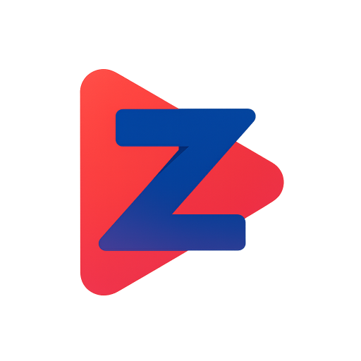

<div align="center">
  
  #  **Zentrio**
  
  **A profile management system for Stremio Web**
  
  [](https://www.typescriptlang.org/)
  [](https://deno.land/)
  [](https://fresh.deno.dev/)
  [](https://www.mongodb.com/)
  [](https://www.docker.com/)
  
  **[🚀 Public Instance](https://zentrio.eu)** • **[🐛 Report Issues](https://github.com/MichielEijpe/Zentrio/issues)**
  
</div>

---

<details>
<summary>🛡️ Important Note & Disclaimer</summary>

Welcome to Zentrio! Before you proceed, please take a moment to read this.

**About Development:** This project has been largely developed with the help of AI assistants like GitHub Copilot and Claude. While I carefully review and test the code, it's important to know that a significant portion of the codebase has been generated or enhanced by AI.

**Your Security:**
*   **Use Unique Passwords:** For your own safety, please use a unique password for Zentrio that you don't use anywhere else.
*   **New Stremio Profiles:** It is strongly recommended to create new, empty Stremio profiles when using this service, instead of linking your existing ones.

**Legal Disclaimer:** This is a personal project and is not affiliated with, endorsed, or sponsored by Stremio. I acknowledge that this service may test the boundaries of Stremio's terms of service and will comply with any and all takedown or cease and desist notices from Stremio or its legal representatives. The official Stremio website can be found at [stremio.com](https://stremio.com).

</details>

---

## ✨ **Features**

- **Profile Management**: Unlimited profiles with custom avatars.
- **Content Filtering**: Per-profile NSFW filtering.
- **Addon Management**: Reorder and sync addons.
- **PWA Support**: Installable as a web app.

---

## 🚀 **Quick Start**

```bash
# Clone and setup
git clone https://github.com/MichielEijpe/Zentrio.git
cd Zentrio
cp .env.example .env

# Edit .env with your credentials (see below)

# Start development server
cd app && deno task start
```

**Environment Variables (`.env`):**

Create a `.env` file in the root directory by copying the example: `cp .env.example .env`. Then, fill in the following variables:

| Variable | Description | Default |
| :--- | :--- | :--- |
| `MONGO_URI` | **Required.** Your MongoDB connection string. | `""` |
| `EMAIL_PROVIDER` | **Required.** The email service to use. Can be `resend` or `smtp`. | `resend` |
| `RESEND_API_KEY` | **Required if `EMAIL_PROVIDER` is `resend`**. Your API key for Resend. | `""` |
| `SMTP_HOST` | **Required if `EMAIL_PROVIDER` is `smtp`**. Hostname of your SMTP server. | `""` |
| `SMTP_PORT` | **Required if `EMAIL_PROVIDER` is `smtp`**. Port for your SMTP server. | `587` |
| `SMTP_USER` | **Required if `EMAIL_PROVIDER` is `smtp`**. Username for your SMTP server. | `""` |
| `SMTP_PASS` | **Required if `EMAIL_PROVIDER` is `smtp`**. Password for your SMTP server. | `""` |
| `SMTP_SECURE`| **Required if `EMAIL_PROVIDER` is `smtp`**. Use `true` for direct SSL/TLS (port 465) or `false` for STARTTLS (port 587/25). | `false` |
| `EMAIL_FROM_DOMAIN` | **Required.** The "from" address for emails. For Resend, use `onboarding@resend.dev` for testing if you don't have a verified domain. | `""` |
| `ENCRYPTION_MASTER_KEY` | **Required.** A 64-character hex key for encrypting sensitive data. | `""` |
| `APP_DOMAIN` | **Required.** The public domain where the app is hosted, including the protocol. | `http://localhost:8000` |

**Generate `ENCRYPTION_MASTER_KEY`:**
```bash
python3 -c "import uuid; print((uuid.uuid4().hex + uuid.uuid4().hex))"
```

---

## 🐳 **Docker Deployment**

**Quick Setup:**
```bash
# With included MongoDB
docker-compose up -d

# Or standalone container
docker run -d -p 8000:8000 --env-file .env ghcr.io/michieleijpe/zentrio:latest
```

Includes health checks, MongoDB service, and production-ready configuration.

### **Install**
Visit **[zentrio.eu](https://zentrio.eu)** and use your browser's "Add to Home Screen" or install button to install the Webapp.

---

## 📊 **Project Stats**

<div align="center">
  
  
  
  
  
  
</div>

---

## 🌐 **Public Instance**

You can try Zentrio without setting up anything at **[zentrio.eu](https://zentrio.eu)** - our free public instance that's always up-to-date with the latest features.

---

## 💖 **Acknowledgments**

Special thanks to:

- **[pancake3000](https://github.com/pancake3000/stremio-addon-manager)** - Original addon manager concept
- **[Stremio Team](https://www.stremio.com/)** - Amazing streaming platform
- **[Deno Team](https://deno.land/)** - Revolutionary JavaScript runtime
- **Our Contributors** - Making Zentrio better every day

---

## 📄 **License**

This project is licensed under the MIT License - see the [LICENSE](LICENSE) file for details.

---

<div align="center">
  
  **Made with ❤️ for the Stremio Community**
  
  ⭐ **Star this repo if you found it helpful!** ⭐
  
</div>
