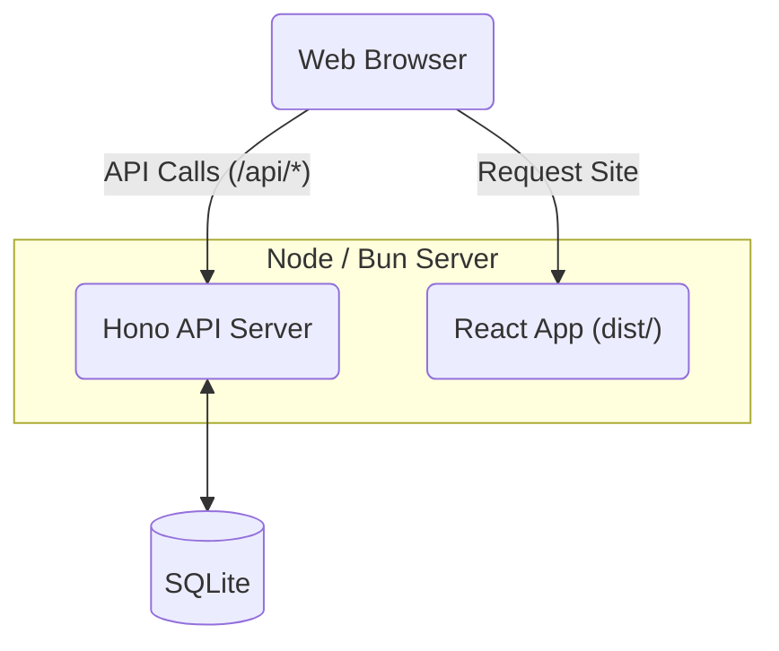
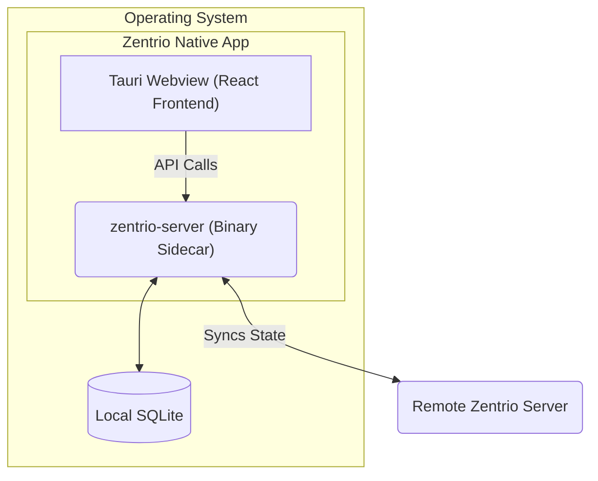

# Development Guide

[API Documentation](https://app.zentrio.eu/api/docs)

Welcome to the Zentrio developer documentation. Zentrio is a modern streaming platform utilizing a unique architecture to deliver seamless experiences across Web, Desktop, and Mobile.

## Technology Stack

- **Frontend**: React 19, Vite, Tailwind CSS (v4), Zustand
- **Backend (API)**: Hono, SQLite (`bun:sqlite`), Better Auth
- **Native Shell**: Tauri v2, Rust
- **Runtime & Tooling**: Bun, TypeScript

## Application Architecture

Zentrio's architecture separates the React frontend from the Hono API backend. How these two pieces interact depends on the environment you are running in:

### 1. The Web Environment

When hosted as a standard web application, Zentrio runs a Node/Bun server. The compiled React frontend (the `dist/` output from Vite) is statically served by the Hono API server, which simultaneously handles all `/api/*` data requests.



### 2. The Native App Environment (Tauri v2)

For Desktop and Mobile apps, Zentrio uses **Tauri v2**.

- **The UI**: The React frontend is compiled locally and injected directly into Tauri's native webview.
- **The API sidecar**: Tauri launches the backend API as a native external binary (sidecar) packaged within the app installer (e.g., `bin/zentrio-server`). The frontend then communicates with this local server over localhost.



---

## Local Development Setup

### Prerequisites

Before diving in, ensure you have the following installed on your machine:

- **[Bun](https://bun.sh)**: Used as the package manager and javascript runtime.
- **Native Tooling** (Optional): [Rust](https://rustup.rs/), [Android Studio](https://developer.android.com/studio), or [Xcode](https://developer.apple.com/xcode/) if you plan to build Tauri apps.

### 1. Clone and Install

Begin by grabbing the code and installing the application dependencies.

```bash
git clone https://github.com/mteij/Zentrio.git
cd Zentrio/app
bun install
```

### 2. Environment Variables

You'll need a `.env` file for local development. Create one in the `app` directory:

```bash
AUTH_SECRET=dev-secret-change-in-production
ENCRYPTION_KEY=0123456789abcdef0123456789abcdef0123456789abcdef0123456789abcdef
DATABASE_URL=file:./data/zentrio.db
```

_Note: SQLite is included out-of-the-box._

### 3. Start Development Servers (Web)

Because Zentrio splits the frontend and backend, you must run both concurrently during local development.

Open two separate terminal windows in the `app` directory:

**Terminal 1: Start the Frontend (Vite)**

```bash
bun run dev
```

_The React UI runs at `http://localhost:5173`._

**Terminal 2: Start the Backend (Hono)**

```bash
bun run dev:server
```

_Vite automatically proxies API requests to this backend instance._

---

## Building Native Apps (Tauri v2)

To run the native GUI applications locally, use the Tauri CLI commands configured in our `package.json`.

**Desktop (Windows / macOS / Linux):**

```bash
bun run tauri dev
```

**Mobile Development:**

```bash
# Android
bun run tauri:android:init  # Run once to setup Android Studio project
bun run tauri:android:dev   # Start Android development

# iOS
bun run tauri ios init      # Run once to setup Xcode project
bun run tauri ios dev       # Start iOS development
```
