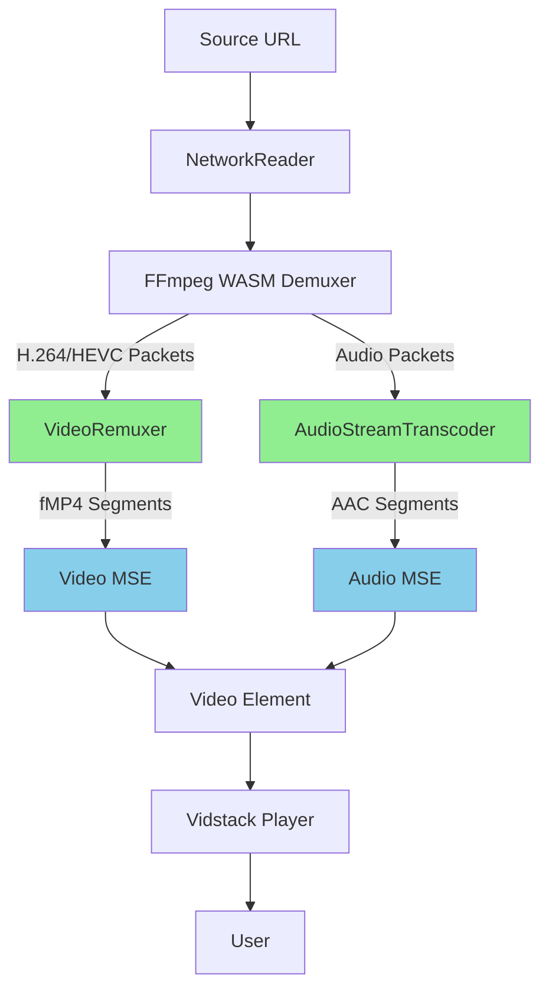

# Hybrid Media Service - True Streaming Implementation Plan

## Goal

Implement **true streaming** for video files with rare audio codecs (FLAC, DTS, AC3, Vorbis) where:
- Video and audio start playing quickly (within seconds)
- Playback continues smoothly while content downloads
- Full Vidstack UI and controls are available
- Works reliably across browsers

## Architecture Overview



## Current Problems

| Component | Issue | Fix Required |
|-----------|-------|-------------|
| HybridEngine | No demuxing - packets never extracted | Implement FFmpeg demuxing loop |
| VideoRemuxer | Never receives data | Connect from demuxer output |
| AudioStreamTranscoder | Downloads entire file before final transcode | Implement segmented transcoding |
| VidstackPlayer | Uses custom UI in hybrid mode | Reuse Vidstack with MSE sources |

## Implementation Plan

### Phase 1: Video Streaming (Critical)

#### 1.1 Implement FFmpeg Demuxing

Create a new [`Demuxer`](app/src/services/hybrid-media/Demuxer.ts) class that uses FFmpeg WASM to extract packets:

```typescript
class FFmpegDemuxer extends EventTarget {
  private ffmpeg: FFmpeg | null = null
  private activeStreams: Set<number> = new Set()
  
  async initialize(url: string, streamIndices: number[]): Promise<void> {
    // Load FFmpeg
    this.ffmpeg = new FFmpeg()
    await this.ffmpeg.load({...})
    
    // Write input file
    const data = await fetch(url)
    await this.ffmpeg.writeFile('input', data)
  }
  
  async startStreaming(streamIndex: number): Promise<void> {
    // Use FFmpeg to stream packets
    // This requires using the FFmpeg C API through JS wrappers
    // Or a simplified approach with mp4box.js
  }
  
  on(event: 'packet', callback: (packet: VideoPacket | AudioPacket) => void)
  on(event: 'end', callback: () => void)
  on(event: 'error', callback: (error: Error) => void)
}
```

**Challenge**: FFmpeg WASM doesn't expose packet-level API. 

**Alternative**: Use `mp4box.js` which has better demuxing support:

```typescript
import MP4Box from 'mp4box'

async function demuxWithMP4Box(data: Uint8Array): {
  video: Uint8Array[],
  audio: Uint8Array[]
} {
  const mp4box = MP4Box.createFile()
  
  return new Promise((resolve, reject) => {
    mp4box.onReady = (info) => {
      // Extract video track
      // Extract audio track
      resolve({ video: [], audio: [] })
    }
    
    mp4box.onError = reject
    mp4box.appendBuffer(data.buffer)
    mp4box.flush()
  })
}
```

**Recommendation**: Use mp4box.js for demuxing. It's already imported in VideoRemuxer.

#### 1.2 Connect Video Path

Modify [`HybridEngine.processVideo()`](app/src/services/hybrid-media/HybridEngine.ts):

```typescript
private async processVideo(): Promise<void> {
  if (this.isProcessing) return
  this.isProcessing = true

  try {
    // Initialize MP4Box for demuxing
    await this.initializeDemuxer()
    
    // Download and process chunks
    let offset = 0
    const chunkSize = 5 * 1024 * 1024 // 5MB chunks
    
    while (!this.shouldStop && offset < this.reader.size) {
      const end = Math.min(offset + chunkSize, this.reader.size)
      const chunk = await this.reader.read(offset, chunkSize)
      
      // Feed to demuxer
      this.demuxer.appendBuffer(chunk)
      
      // Demuxer will emit packets
      // Video packets go to VideoRemuxer.push()
      // Audio packets go to AudioTranscoder
      
      offset = end
    }
    
  } finally {
    this.isProcessing = false
  }
}
```

#### 1.3 Implement VideoRemuxer.push() Integration

The [`VideoRemuxer.push()`](app/src/services/hybrid-media/VideoRemuxer.ts:235) method exists but needs to actually process packets:

```typescript
// In VideoRemuxer, ensure push() properly processes packets
async push(packet: VideoPacket): Promise<void> {
  if (!this.isInitialized) return
  
  // This is already implemented correctly!
  // Just need to ensure packets are being sent to it
  // ...
}
```

### Phase 2: Audio Streaming (High Priority)

#### 2.1 Implement Segmented Audio Transcoding

Modify [`AudioStreamTranscoder`](app/src/services/hybrid-media/AudioStreamTranscoder.ts) to transcode incrementally:

```typescript
class AudioStreamTranscoder extends EventTarget {
  // ... existing code ...
  
  private segmentDuration: number = 2 // 2-second segments
  private currentSegmentBuffer: Uint8Array[] = []
  private currentSegmentDuration: number = 0
  
  async transcodeStream(): Promise<void> {
    // Instead of final transcode with entire file:
    // 1. Collect packets for one segment duration
    // 2. Transcode that segment to AAC fMP4
    // 3. Append to MSE
    // 4. Repeat
    
    while (!this.shouldStop) {
      // Wait for next segment of packets
      const segmentData = await this.waitForSegment()
      
      if (!segmentData) break // EOF
      
      // Transcode this segment
      await this.transcodeSegment(segmentData)
    }
  }
  
  private async transcodeSegment(data: Uint8Array): Promise<Uint8Array> {
    await this.ffmpeg.writeFile('segment_input', data)
    
    // Transcode to fMP4 segment
    await this.ffmpeg.exec([
      '-i', 'segment_input',
      '-map', `0:a:${this.audioStreamIndex}`,
      '-c:a', 'aac',
      '-b:a', this.config.bitrate,
      '-f', 'mp4',
      '-movflags', '+frag_keyframe+empty_moov+default_base_moof',
      '-y',
      'segment.m4a'
    ])
    
    const output = await this.ffmpeg.readFile('segment.m4a')
    await this.ffmpeg.deleteFile('segment_input')
    await this.ffmpeg.deleteFile('segment.m4a')
    
    return new Uint8Array(output as Uint8Array)
  }
}
```

#### 2.2 Progressive MSE Appending

Modify the append logic to add segments as they become ready:

```typescript
// In HybridEngine
async attachAudio(): Promise<void> {
  // ... existing init code ...
  
  // Listen for segments from transcoder
  this.audioTranscoder.addEventListener('segment', async (e: any) => {
    const segment = e.detail.data
    
    // Append to MSE
    if (this.sourceBuffer?.updating) {
      this.pendingAudioSegments.push(segment)
    } else {
      this.sourceBuffer.appendBuffer(segment.buffer)
    }
  })
  
  // Start streaming transcoding
  this.audioTranscoder.startStreaming()
}
```

### Phase 3: Use Vidstack Controls (Medium Priority)

#### 3.1 Create MSE Sources for Vidstack

Instead of custom video element, create MediaSource URLs and pass to Vidstack:

```typescript
// In VidstackPlayer.tsx, hybrid mode:
if (playbackMode === 'hybrid') {
  const videoMediaSrc = videoMSEUrl  // VideoRemuxer's MediaSource
  const audioMediaSrc = audioMSEUrl // AudioTranscoder's MediaSource
  
  return (
    <MediaPlayer
      ref={playerRef}
      // We'll provide a custom provider that merges two sources
      src={{
        src: videoMediaSrc,
        type: 'video/mp4',
        audioSrc: audioMediaSrc,
        audioType: 'audio/mp4'
      }}
      // ... rest of Vidstack props
    >
      {/* Vidstack UI works normally */}
      <DefaultVideoLayout />
    </MediaPlayer>
  )
}
```

**Challenge**: Vidstack doesn't natively support separate audio/video sources.

**Alternative**: Keep hidden video + audio elements for MSE, but overlay Vidstack's UI:

```typescript
return (
  <div className="hybrid-container">
    {/* Hidden MSE sources */}
    <video ref={mseVideoRef} muted style={{ display: 'none' }} />
    <audio ref={mseAudioRef} style={{ display: 'none' }} />
    
    {/* Visible Vidstack UI overlay */}
    <MediaPlayer ref={uiPlayerRef} src="">
      <DefaultVideoLayout />
    </MediaPlayer>
  </div>
)
```

Then sync MSE elements with Vidstack UI state.

### Phase 4: Robustness & Polish (Low Priority)

#### 4.1 Better Codec Detection

Replace heuristic with actual probing:

```typescript
async function actuallyNeedsHybridPlayback(url: string): Promise<boolean> {
  // Use HybridEngine to probe
  const engine = new HybridEngine()
  await engine.initialize(url)
  const needsHybrid = engine.requiresHybridPlayback
  await engine.destroy()
  
  // Cache result
  probeCache.set(url, { 
    mode: needsHybrid ? 'hybrid' : 'native',
    duration: engine.totalDuration 
  })
  
  return needsHybrid
}
```

#### 4.2 Improved Audio Sync

Implement rate-based sync:

```typescript
// In HybridEngine.processVideo()
while (!this.shouldStop) {
  await new Promise(r => setTimeout(r, 100))
  
  const videoTime = this.videoElement?.currentTime || 0
  const audioTime = this.transcodedAudioElement?.currentTime || 0
  const drift = audioTime - videoTime
  
  if (Math.abs(drift) > 0.1) { // Tighter threshold
    // Gradually adjust rate instead of jumping
    const rate = drift > 0 ? 1.02 : 0.98
    this.transcodedAudioElement.playbackRate = rate
    
    // Reset rate after a short time
    setTimeout(() => {
      this.transcodedAudioElement!.playbackRate = 1.0
    }, 200)
  }
}
```

#### 4.3 Better Error Handling

Provide actionable error messages:

```typescript
// In VidstackPlayer, hybrid init error
catch (error) {
  console.error('[VidstackPlayer] Hybrid init failed:', error)
  
  // Show user-friendly error
  const errorMessage = error.message.includes('ffmpeg') 
    ? 'Audio transcoding failed. Try downloading or using external player.'
    : 'Playback failed. This format may not be supported.'
  
  onError?.(new Error(errorMessage))
  
  // Offer fallback options
  setPlaybackError({
    message: errorMessage,
    actions: [
      { label: 'Download', onClick: () => downloadFile(src) },
      { label: 'External Player', onClick: () => openInExternalPlayer(src) }
    ]
  })
}
```

## Simplified Alternative Approach

Given the complexity of true streaming, consider this **two-phase approach**:

### Phase 1: Quick Start (MVP)

```
1. Download first 10MB of file
2. Transcode only that portion (video + audio)
3. Start playback immediately with partial content
4. Continue downloading in background
5. As more content becomes available, reload source or append to MSE
```

### Phase 2: True Streaming

```
Implement full segmented transcoding as described above
```

This gives users quick feedback while reducing implementation complexity.

## Implementation Order

### Sprint 1 (Week 1): Basic Video Path
1. Implement FFmpeg/mp4box demuxing
2. Connect demuxer → VideoRemuxer
3. Test video appears in MSE

### Sprint 2 (Week 1-2): Basic Audio Path  
1. Implement single-segment audio transcoding
2. Connect demuxer → AudioTranscoder
3. Test audio playback

### Sprint 3 (Week 2): Progressive Streaming
1. Implement segmented audio transcoding
2. Implement progressive MSE appending
3. Test with large files

### Sprint 4 (Week 3): Vidstack Integration
1. Either integrate MSE with Vidstack or create overlay
2. Ensure full UI functionality
3. Polish UX

### Sprint 5 (Week 4): Robustness
1. Better error handling
2. Improved sync
3. Edge case handling

## Testing Plan

### Test Case 1: Small File (<100MB)
- File: MKV with DTS audio
- Expected: Play starts within 5 seconds
- Verify: Video + audio play, seek works

### Test Case 2: Large File (>5GB)
- File: MKV with FLAC audio  
- Expected: Play starts within 10-15 seconds
- Verify: Can seek to middle, no buffering issues

### Test Case 3: Tauri Environment
- Verify: Hybrid mode never activates
- Verify: Native player works correctly

### Test Case 4: Edge Cases
- File with no audio stream
- File with multiple audio streams
- Corrupted file
- Network interruption during download

## Risk Assessment

| Risk | Impact | Mitigation |
|-------|--------|------------|
| FFmpeg WASM performance | High | Use mp4box.js where possible, optimize FFmpeg args |
| Browser MSE compatibility | Medium | Feature detection, graceful fallback |
| Memory usage (large files) | Medium | Chunk size limits, cleanup |
| Audio sync drift | Medium | Rate-based sync, frequent correction |
| Complexity | High | Implement incrementally, test often |

## Success Criteria

- [ ] Video plays in hybrid mode (currently doesn't work)
- [ ] Audio plays in hybrid mode with transcoding
- [ ] Playback starts within 10-15 seconds of large files
- [ ] Seeking works reasonably well
- [ ] Full Vidstack UI available in hybrid mode
- [ ] Hybrid mode never activates in Tauri
- [ ] Graceful error handling with user actions

## Notes

1. **mp4box.js is the key** - It supports demuxing better than current FFmpeg WASM approach
2. **Segmented transcoding is complex** - May need multiple FFmpeg instances or clever queuing
3. **Memory management** - Must cleanup FFmpeg instances regularly
4. **Browser limits** - MSE has limits on buffer size (documented in VideoRemuxer)
5. **Alternative to consider**: Server-side transcoding (if control over server)

## Conclusion

The current implementation is fundamentally incomplete because:
1. **Video path never receives data** - No demuxing
2. **Audio isn't truly streaming** - Downloads entire file first

The proposed implementation fixes both by:
1. Using mp4box.js to demux and extract packets
2. Implementing segmented audio transcoding with progressive MSE append
3. Preserving Vidstack's full UI experience

This is a significant undertaking (estimated 3-4 weeks) but will deliver the "true streaming" experience requested.