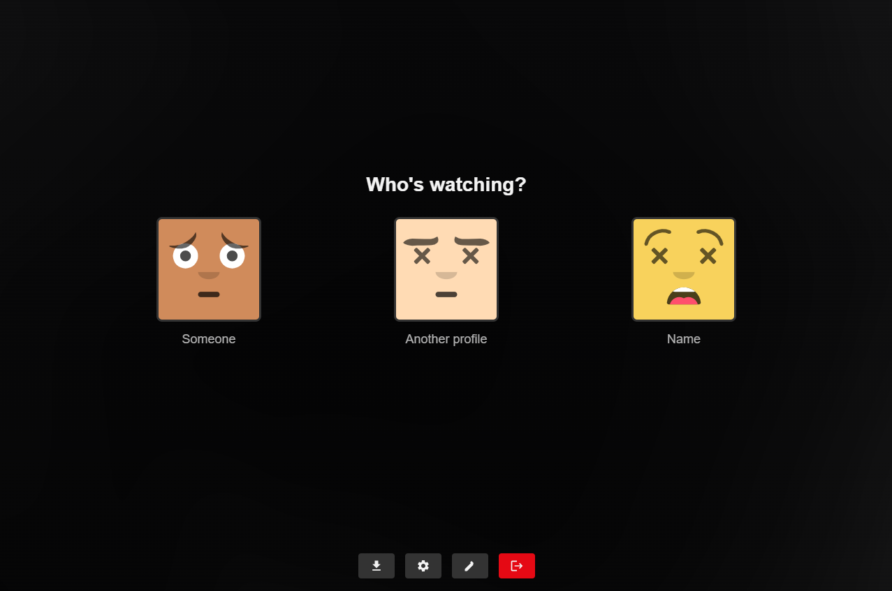

# Zentrio

## <b>Please do not currently use! Under heavy development</b>

  

<strong>Stream Your Way</strong>

<a href="https://app.zentrio.eu"><strong>🌐 Public Instance</strong></a> •
<a href="https://docs.zentrio.eu"><strong>📚 Documentation</strong></a> •
<a href="https://github.com/MichielEijpe/Zentrio/issues"><strong>🐛 Report Issues</strong></a>

<b>⚠️ Disclaimer: Built with AI</b>

Zentrio was built with substantial assistance from AI tooling, guided by an engineering student exploring what these tools make possible.

Although the project is maintained with care, it remains experimental and may contain imperfections. **Please use it at your own risk.**

## 🚀 Getting Started

Zentrio is easiest to explore via the public instance and hosted documentation:

- 🌐 Public instance: [**app.zentrio.eu**](https://app.zentrio.eu)
- 📚 Documentation: [**docs.zentrio.eu**](https://docs.zentrio.eu)

For deployment, self-hosting, and development setup instructions, refer to the documentation.

## 📖 What is Zentrio?

Zentrio is a modern, self-hosted streaming platform that brings your content together. Built as a standalone application with a focus on user experience, customization, and privacy.

### ✨ Features

- **👥 Multi-Profile Support** - Create separate profiles with unique preferences, watch history, and settings
- **🎨 Modern UI** - A clean, glassmorphic interface designed for immersion
- **🧩 Addon Ecosystem** - Extend functionality with community addons (Stremio-compatible)
- **📱 Cross-Platform** - Web, Desktop (Windows/macOS/Linux), Android, iOS, and PWA
- **☁️ Cloud Sync** - Sync your settings and progress across devices
- **🔐 Flexible Auth** - Email/password, OAuth (Google, GitHub, Discord), and 2FA support
- **🎬 Built-in Player** - Stream content with HLS, DASH, and direct playback support
- **🔒 Privacy-Focused** - Self-host your data, encrypted and secure

<!-- 

  

 -->

## 📜 Origin Story

Zentrio started as a weekend project inspired by a [community feature request](https://github.com/Stremio/stremio-features/issues/622) for profile management. What began as a simple profile switcher evolved into something much larger.

As development progressed, the vision expanded beyond its original scope. A truly great experience required more than just profile switching—it needed a dedicated interface, better content discovery, and a cohesive design. Today, Zentrio stands as its own independent streaming platform with support for community addons.

## 📄 License

This project is licensed under the MIT License. See [LICENSE](LICENSE) for details.

## ℹ️ Trademark Notice

Zentrio is an independent project. While it supports Stremio-compatible addons, it is not affiliated with, endorsed by, or sponsored by Stremio. "Stremio" and associated trademarks are the property of their respective owners.

---

  <strong>🌟 Star this repo if you find Zentrio helpful!</strong>

