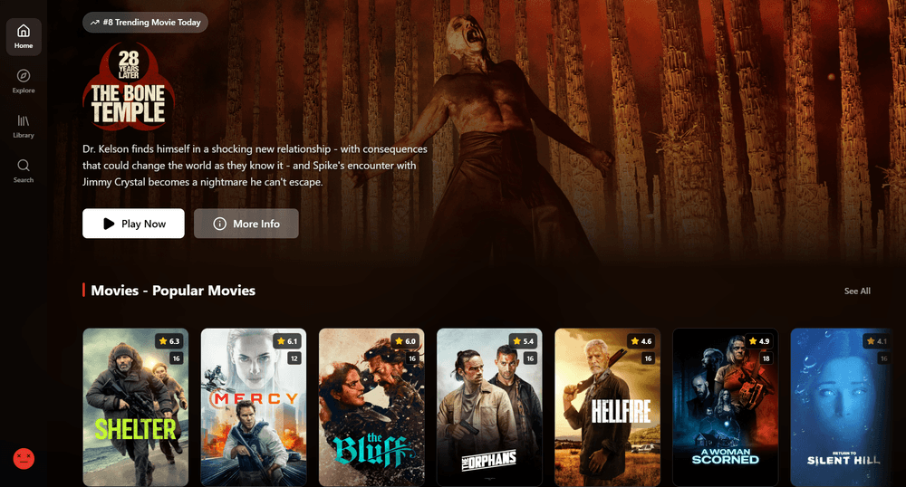

<div align="center">
  

  <h1>Zentrio</h1>

  <p><strong>Stream anything. Own everything.</strong></p>

  <p>
    Self-hosted streaming across web and native clients with profiles,
    Stremio-compatible addons, Trakt sync, admin tooling, and offline-capable apps.
  </p>

  <p>
    <a href="https://zentrio.eu"><strong>Website</strong></a> |
    <a href="https://app.zentrio.eu"><strong>Public Instance</strong></a> |
    <a href="https://zentrio.eu/releases"><strong>Downloads</strong></a> |
    <a href="https://docs.zentrio.eu"><strong>Docs</strong></a> |
    <a href="https://github.com/Mteij/Zentrio/issues"><strong>Issues</strong></a>
  </p>

  <p>
    <a href="https://bun.sh"></a>
    <a href="https://www.typescriptlang.org/"></a>
    <a href="https://tauri.app/"></a>
    <a href="https://www.sqlite.org/"></a>
    <a href="https://github.com/MichielEijpe/Zentrio/actions/workflows/quality.yml"></a>
    <a href="https://github.com/Mteij/Zentrio/stargazers"></a>
    <a href="https://github.com/Mteij/Zentrio/releases"></a>
  </p>
</div>

> Try it before you self-host: use the [public instance](https://app.zentrio.eu).

## What Zentrio Is

Zentrio is a self-hosted streaming platform that combines a Bun + Hono backend, a React web app, and native Tauri clients in one project. It is designed for people who want a polished personal streaming setup without giving up control of their data, server, or addon stack.

## Why It Stands Out

- Multi-profile by design: watch history, streaming preferences, filters, and appearance stay separate per profile.
- Stremio-compatible addon ecosystem: install addons by URL, reorder sources, and mix the built-in TMDB addon with third-party manifests.
- Native apps where it matters: desktop and Android builds support native auth flows, local-first reads, and offline downloads.
- Self-hosting without sprawl: one `.env`, SQLite, and a single `docker compose up -d` are enough to get started.

## Quick Start

The fastest way to run Zentrio is with Docker Compose from the repository root.

1. Copy the example environment file.

```bash
cp .env.example .env
```

PowerShell:

```powershell
Copy-Item .env.example .env
```

2. Fill in the required values.

```env
AUTH_SECRET=replace-me
ENCRYPTION_KEY=replace-me
TMDB_API_KEY=your-tmdb-api-key
```

Recommended secrets:

```bash
openssl rand -base64 32
openssl rand -hex 32
```

3. Start the stack.

```bash
docker compose up -d
```

4. Open `http://localhost:3000`.

If you want to protect the first superadmin claim, set `ADMIN_SETUP_TOKEN` in `.env` before the first sign-in. Full setup details live in [docs/self-hosting.md](docs/self-hosting.md).



## Download Native Apps

Native builds are available for Windows, macOS, Linux, and Android.

- Release site: [zentrio.eu/releases](https://zentrio.eu/releases)
- GitHub Releases: [github.com/Mteij/Zentrio/releases](https://github.com/Mteij/Zentrio/releases)

## Highlights

| Area | What you get |
| --- | --- |
| Profiles | Separate history, filters, settings, and appearance per profile |
| Streaming | Stremio-compatible addons, source ordering, and a built-in TMDB addon |
| Native clients | Desktop and Android apps through Tauri v2 |
| Offline support | Native download queue, quotas, and storage stats |
| Trakt | Sync, scrobbling, recommendations, and check-ins |
| Auth | Email/password, magic links, OTP, 2FA, and SSO providers |
| Admin | User management, audit logs, analytics, and step-up verification |
| API | OpenAPI docs at `/api/docs` and Stremio-compatible addon endpoints |

## Local Development

Zentrio is a monorepo with three main workspaces:

- `app/` for the product codebase
- `docs/` for the VitePress documentation site
- `landing/` for the marketing site

If you are working on the app itself:

```bash
cd app
bun install
```

Run the frontend and backend in separate terminals:

```bash
# Terminal 1: frontend at http://localhost:5173
bun run dev
```

```bash
# Terminal 2: backend at http://localhost:3000
bun run dev:server
```

Useful commands from `app/`:

```bash
bun run type-check
bun run test
bun run lint
bun run tauri:dev
```

The shared `.env` file lives in the repository root, not inside `app/`. For deeper setup details, see [docs/development.md](docs/development.md).

## Architecture

- Frontend: React 19, React Router v7, TanStack Query, Zustand
- Backend: Bun, Hono, SQLite
- Native: Tauri v2 with a Rust sidecar model
- Auth: Better Auth with email, magic links, OTP, 2FA, and SSO plugins

Repository map: [llm/ARCHITECTURE.md](llm/ARCHITECTURE.md)

## Contributing

Contributions are welcome. Open an issue before starting significant work so direction stays aligned. Guidelines live in [docs/contributing.md](docs/contributing.md).

## Acknowledgements

- [tmdb-addon](https://github.com/mrcanelas/tmdb-addon) by mrcanelas. Zentrio's internal TMDB addon is substantially derived from this project.
- [IntroDB](https://introdb.app) for intro, recap, and outro timestamps
- [Fanart.tv](https://fanart.tv) for artwork and logos
- [IMDb datasets](https://developer.imdb.com/non-commercial-datasets/) for ratings data
- [DiceBear](https://www.dicebear.com) for profile avatar generation
- [Better Auth](https://www.better-auth.com) for authentication

## Project Note

Zentrio was developed with significant AI assistance. Large language models helped shape parts of the code, architecture, and documentation. The project is functional and actively maintained, but that context is useful if you are evaluating it for production use.

## Trademark Notice

Zentrio is an independent project. It supports Stremio-compatible addons but is not affiliated with, endorsed by, or sponsored by Stremio. "Stremio" and related marks belong to their respective owners.

## License

MIT. See [LICENSE](LICENSE).
